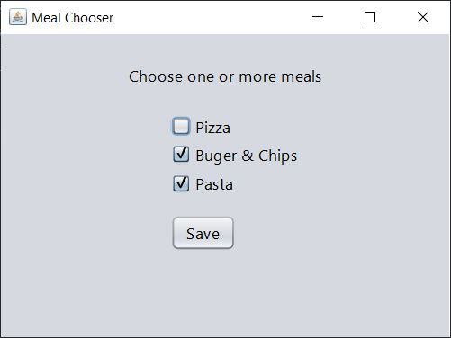

# Save To File

This example shows a simple way to write objects to (and read from) a binary file.

Checkbox selection is recorded to a simple boolean array, and then the array is written as an object to file whenever the user clicks on the `Save` button.

When the program starts, it checks for the binary file (and creates a blank one if it's not found) then reads it and recreates the binary array from the last session.

